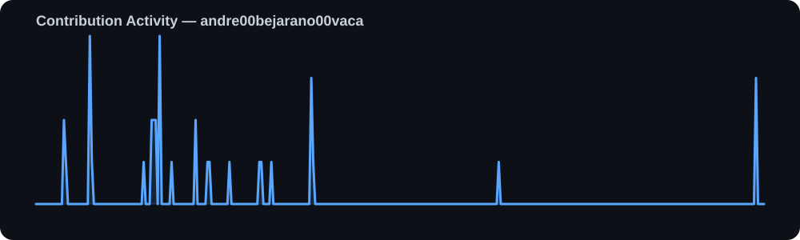

# 👋 Hola, soy Andre

### Full Stack Developer · React · Next.js · Spring Boot

Construyo aplicaciones web y móviles, sistemas integrados y soluciones digitales enfocadas en **experiencia de usuario, automatización y rendimiento**.

<p align="center">
  
  <a href="https://github.com/andre00bejarano00vaca">
    
  </a>
</p>

---

## ⚡ Stack

<p align="center">
  
</p>

---

## 📊 GitHub Analytics
<p align="center">


</p>

<p align="center">


</p>


<p align="center">
  
</p>

---

## 📈 Contribution Activity

<p align="center">
  
</p>

---

## 🚀 Featured Projects

<table>
<tr>
<td width="50%">

### 🐄 Remate Ganadero

Aplicación móvil para gestión de remates ganaderos con comunicación en tiempo real.

**React Native · Expo · WebSockets · Spring Boot**

</td>

<td width="50%">

### 🔗 LittleLink Personalizado

Plataforma personal de enlaces con analítica y despliegue mediante Docker.

**Next.js · Docker · Umami · Cloudflare**

</td>
</tr>

<tr>
<td width="50%">

### 🌐 Web Solutions

Desarrollo de sitios web y plataformas digitales para negocios y profesionales.

**React · Next.js · UX/UI**

</td>

<td width="50%">

### ⚙️ System Integration

Integración de APIs, automatización de procesos y despliegue de servicios.

**Java · Spring Boot · PostgreSQL · Linux**

</td>
</tr>
</table>

---

## 🧠 What I'm building

```text
Frontend        ███████████████████░   React / Next.js
Backend         ████████████████░░░░   Spring Boot
Mobile          ███████████████░░░░░   React Native
Databases       ██████████████░░░░░░   PostgreSQL
Infrastructure  ████████████░░░░░░░░   Docker / Linux
Automation      █████████████░░░░░░░   APIs / AI
```

---

## 🐍 Contribution Snake

<p align="center">
  
</p>

---

## 📫 Connect with me

<p align="center">
  <a href="https://github.com/andre00bejarano00vaca">
    
  </a>
  <a href="https://www.linkedin.com/in/andre-bejarano-1628b8249/">
    
  </a>
</p>

---

<p align="center">
  <i>Building digital solutions, one commit at a time.</i>
</p>
